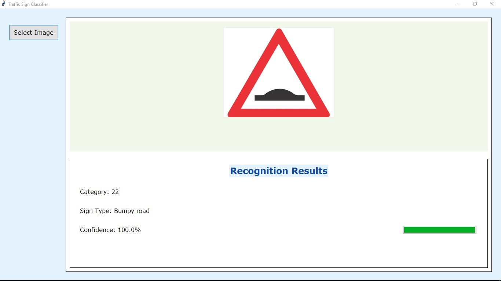

# Traffic Sign Recognition System

A Python-based application for recognizing traffic signs using TensorFlow and OpenCV, featuring a sleek GUI built with Tkinter.

## Overview

This project implements a traffic sign recognition system capable of identifying 43 distinct traffic sign categories. The system leverages a convolutional neural network (CNN) trained on the German Traffic Sign Recognition Benchmark (GTSRB) dataset.

## Features

- Intuitive and modern GUI interface
- Real-time image classification
- Compatibility with various image formats
- Confidence score visualization for predictions
- Detailed traffic sign classification information

## Implementation Details

The system is powered by a CNN model built with TensorFlow, incorporating the following key features:
- Input image dimensions: 30x30 pixels
- Support for 43 traffic sign classes
- Preprocessing pipeline for consistent input formatting
- Confidence score computation for predictions

## Experimentation Process

During the development phase, several techniques and approaches were explored:

### Model Architecture Exploration
- Started with a simple CNN design
- Experimented with different configurations of layers and dropout rates
- Observed that deeper networks did not always yield better results due to the small input size
- Settled on a final architecture that balanced accuracy and computational efficiency

### Image Preprocessing Challenges
- Encountered issues with varying image dimensions and orientations
- Adopted a centered scaling approach to preserve aspect ratio
- Tested multiple preprocessing methods:
  - Direct resizing (caused distortion)
  - Padding followed by resizing (produced better results)
  - Center cropping and resizing (effective for well-centered signs)
- The final solution combines aspect ratio preservation with centered placement for optimal results

### GUI Development Enhancements
- Began with a basic Tkinter interface
- Gradually introduced improvements:
  - Modernized styling and color themes
  - Confidence score visualization using a progress bar
  - Responsive layout for better usability
- Enhanced user feedback during image processing for a smoother experience

## Results

Below is an example of successful recognition:

  
*Example: High-confidence recognition of a "Bumpy Road" sign*

## Lessons Learned

- Effective preprocessing is critical for achieving high model performance
- Balancing model complexity with input size is essential
- Providing clear user feedback greatly enhances the user experience
- Preserving image aspect ratio is vital for accurate predictions
- Real-time processing requires careful optimization

## Future Enhancements

- Add functionality for video input
- Enable batch processing of multiple images
- Integrate model retraining capabilities
- Improve preprocessing to handle poor lighting conditions
- Support detection of multiple signs in a single image

## Getting Started

1. Install the required dependencies:
```bash
pip install tensorflow opencv-python pillow
```

2. Launch the application:
```bash
python predict_sign.py
```

**Note**: Ensure the model file `best_model.h5` is located in the same directory as the script.
